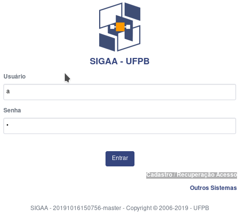

```{r xaringan-themer, include = FALSE}
# install.packages(c("xaringan", "devtools"))
# devtools::install_github("gadenbuie/xaringanthemer")
library(xaringanthemer)
mono_dark(
  base_color = "#FF7100",
  header_font_google = google_font("Josefin Sans"),
  text_font_google   = google_font("Barlow", "400", "400i"),
  code_font_google   = google_font("Droid Mono"),
)
```


background-image: url("img/logo-branca.png")
background-size: 100px
background-position: 100% 0%


# Contato / Redes Sociais do DE

</br>
</br>

[`r icon::fa("link")` **Site do Departamento**: **http://www.de.ufpb.br/**](http://www.de.ufpb.br/)  
[`r icon::fa("paper-plane")` **E-mail do professor: pedro.rafael.marinho@gmail.com**](mailto:pedro.rafael.marinho@gmail.com)</br>
[`r icon::fa("instagram")` **@estatisticaufpb**](https://www.instagram.com/estatisticaufpb/)  
[`r icon::fa("twitter")` **@estatisticaufpb**](https://twitter.com/estatisticaufpb)  
[`r icon::fa("github")` **@de-ufpb**](https://github.com/de-ufpb)  


---
background-size: 100px
background-position: 100% 0%
class: middle, center, inverse

# Algumas informações úteis sobre o professor

---
background-image: url("img/logo-branca.png")
background-size: 100px
background-position: 100% 0%

# Informações sobre o professor

--

.font120[Me chamo [**Pedro Rafael Diniz Marinho**](https://sigaa.ufpb.br/sigaa/public/docente/portal.jsf?siape=1222560) e sou docente do [**Departamento de Estatística da UFPB**](http://www.de.ufpb.br/) desde o ano de 2016.] 

--

</br>

.font150[**Minha Formação**]


--

Toda minha formação é na estatística (bacharelado, mestrado e doutorado). 

--

.font150[**Minha Sala**]

A minha sala é a de número **12** (última sala do corredor do DE, lado direito de quem entra).


--

.font150[**Meu e-mail que mais utilizo**]

Para entrar em contato comigo utilize, de preferência, o e-mail **pedro.rafael.marinho@gmail.com**.

---
background-size: 100px
background-position: 100% 0%
class: middle, center, inverse

# SIGAA

---
background-image: url("img/logo-branca.png")
background-size: 100px
background-position: 100% 0%

# Acesse o SIGAA com frequência

--

.pull-left[


Todo o plano de curso da disciplina encontra-se registrado no SIGAA. 

</br>

Tudo o que for de relevante para o curso será registrado no SIGAA. Dessa forma, é de total responsabilidade do aluno(a) se manter atualizado sobre tudo aquilo que for registrado no sistema.

</br>

As datas de todas as avaliações já encontram-se registrada no SIGAA mas poderão sofrer alterações. Dessa forma, acesse essa disciplina no SIGAA ao menos duas vezes por semana para se manter atualizado.
]

--

.fadeInLeft.animated[
.pull-right[
```{r, echo=FALSE,out.width="450px", out.height="450px",fig.cap="",fig.show='hold',fig.align='left'}

```
]]


---
background-size: 100px
background-position: 100% 0%
class: middle, center, inverse

# Sobre a disciplina
 

---
background-image: url("img/logo-branca.png")
background-size: 100px
background-position: 100% 0%

# Programação Estatística I

A disciplina de **Programação Aplicada à Estatística** que será denominada de **Programação Estatística I** na nova reformulação do Projeto Pedagógico do Curso - PPC do Bacharelado em Estatística da UFPB tem como objetivos:

--

</br>


  - Desenvolver o aluno na capacidade de raciocínio em lógica de programação;
  
</br>  

--
  
  - Introduzir o contato do aluno com as principais estruturas de programação que serão úteis na disciplina de **Programação Estatística II** (**Programação em linguagem R**);
  
</br>  

--
  
  - Introduzir o aluno na linguagem de programação [**C++**](https://pt.wikipedia.org/wiki/C%2B%2B).


---
background-size: 100px
background-position: 100% 0%
class: middle, center, inverse

# Reposição de prova
 


---
background-image: url("img/logo-branca.png")
background-size: 100px
background-position: 100% 0%

# Reposição

--

`r icon::fa("gavel", animate = "spin", size = 3)` 

</br>


.fonte150[O aluno terá direto a apenas uma reposição de uma das avaliações desde que satisfeito o que rege a [**Resolução  Nº 16/2015**](http://www.prg.ufpb.br/prg/codesc/documentos/legislacao/rsep16_2015.pdf/@@download/file/Rsep16_2015.pdf) do CONSEPE que aprova o Regulamento dos Cursos Regulares de Graduação da UFPB.]

</br>

.fonte150[O aluno poderá repor uma prova desde que entre com pedido de reposição junto à coordenação do seu curso. O coordenador de seu curso irá avaliar o pedido de reposição com base na [**Resolução**](http://www.prg.ufpb.br/prg/codesc/documentos/legislacao/rsep16_2015.pdf/@@download/file/Rsep16_2015.pdf) do CONSEPE e encaminhará o pedido julgado ao Departamento de Estatística - UFPB.
]

</br>

.fonte150[Apenas irá repor a prova quem atender os requisitos do **Art. 92, § 6**. Sendo assim, qualquer outro motivo não previsto na resolução não será aceito. Dessa forma, não insista!]


---
background-image: url("img/logo-branca.png")
background-size: 100px
background-position: 100% 0%
class: middle, center

.jackInTheBox.animated[
# Obrigado pela sua atenção!
]
