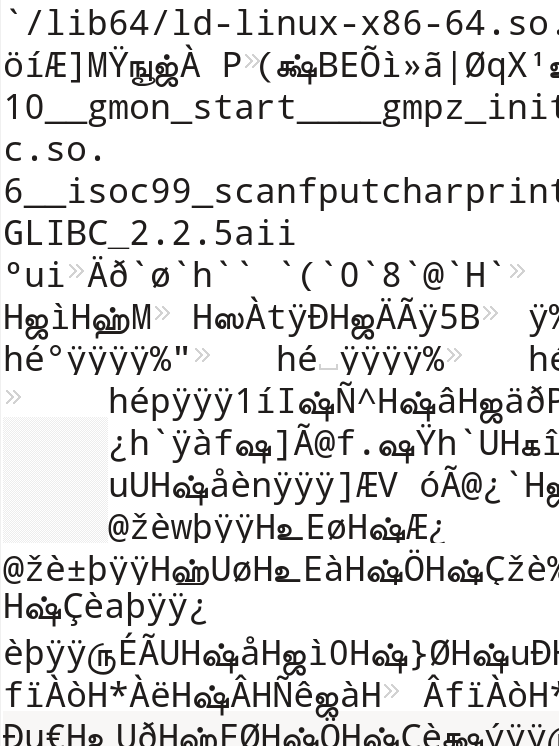
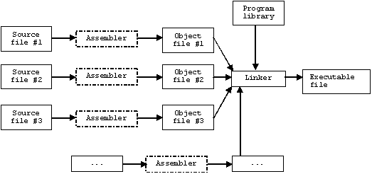

```{r xaringan-themer, include = FALSE}
# install.packages(c("xaringan", "devtools"))
# devtools::install_github("gadenbuie/xaringanthemer")
library(xaringanthemer)
mono_dark(
  base_color = "#FF7100",
  header_font_google = google_font("Josefin Sans"),
  text_font_google   = google_font("Barlow", "400", "400i"),
  code_font_google   = google_font("Droid Mono"),
)
```


background-image: url("img/logo-branca.png")
background-size: 100px
background-position: 100% 0%


# Contato / Redes Sociais do DE

</br>
</br>

[`r icon::fa("link")` **Site do Departamento**: **http://www.de.ufpb.br/**](http://www.de.ufpb.br/)  
[`r icon::fa("paper-plane")` **E-mail do professor: pedro.rafael.marinho@gmail.com**](mailto:pedro.rafael.marinho@gmail.com)</br>
[`r icon::fa("instagram")` **@estatisticaufpb**](https://www.instagram.com/estatisticaufpb/)  
[`r icon::fa("twitter")` **@estatisticaufpb**](https://twitter.com/estatisticaufpb)  
[`r icon::fa("github")` **@de-ufpb**](https://github.com/de-ufpb)  


---
background-size: 100px
background-position: 100% 0%
class: middle, center, inverse

# Algumas informações úteis sobre o professor

---
background-image: url("img/logo-branca.png")
background-size: 100px
background-position: 100% 0%

# Informações sobre o professor

--

.font120[Me chamo [**Pedro Rafael Diniz Marinho**](https://sigaa.ufpb.br/sigaa/public/docente/portal.jsf?siape=1222560) e sou docente do [**Departamento de Estatística da UFPB**](http://www.de.ufpb.br/) desde o ano de 2016.] 

--

</br>

.font150[**Minha Formação**]


--

Toda minha formação é na estatística (bacharelado, mestrado e doutorado). 

--

.font150[**Minha Sala**]

A minha sala é a de número **12** (última sala do corredor do DE, lado direito de quem entra).


--

.font150[**Meu e-mail que mais utilizo**]

Para entrar em contato comigo utilize, de preferência, o e-mail **pedro.rafael.marinho@gmail.com**.

---
background-size: 100px
background-position: 100% 0%
class: middle, center, inverse

# SIGAA

---
background-image: url("img/logo-branca.png")
background-size: 100px
background-position: 100% 0%

# Acesse o SIGAA com frequência

--

.pull-left[


Todo o plano de curso da disciplina encontra-se registrado no SIGAA. 

</br>

Tudo o que for de relevante para o curso será registrado no SIGAA. Dessa forma, é de total responsabilidade do aluno(a) se manter atualizado sobre tudo aquilo que for registrado no sistema.

</br>

As datas de todas as avaliações já encontram-se registrada no SIGAA mas poderão sofrer alterações. Dessa forma, acesse essa disciplina no SIGAA ao menos duas vezes por semana para se manter atualizado.
]

--

.fadeInLeft.animated[
.pull-right[
```{r, echo=FALSE,out.width="450px", out.height="450px",fig.cap="",fig.show='hold',fig.align='left'}
knitr::include_graphics("img/acesso_sigaa.gif")
```
]]


---
background-size: 100px
background-position: 100% 0%
class: middle, center, inverse

# Sobre a disciplina
 

---
background-image: url("img/logo-branca.png")
background-size: 100px
background-position: 100% 0%

# Programação Estatística I

A disciplina de **Programação Aplicada à Estatística** que será denominada de **Programação Estatística I** na nova reformulação do Projeto Pedagógico do Curso - PPC do Bacharelado em Estatística da UFPB tem como objetivos:

--

</br>


  - Desenvolver o aluno na capacidade de raciocínio em lógica de programação;
  
</br>  

--
  
  - Introduzir o contato do aluno com as principais estruturas de programação que serão úteis na disciplina de **Programação Estatística II** (**Programação em linguagem R**);
  
</br>  

--
  
  - Introduzir o aluno na linguagem de programação [**C++**](https://pt.wikipedia.org/wiki/C%2B%2B).


---
background-size: 100px
background-position: 100% 0%
class: middle, center, inverse

# Reposição de prova
 


---
background-image: url("img/logo-branca.png")
background-size: 100px
background-position: 100% 0%

# Reposição

--

`r icon::fa("gavel", animate = "spin", size = 3)` 

</br>


.fonte150[O aluno terá direto a apenas uma reposição de uma das avaliações desde que satisfeito o que rege a [**Resolução  Nº 16/2015**](http://www.prg.ufpb.br/prg/codesc/documentos/legislacao/rsep16_2015.pdf/@@download/file/Rsep16_2015.pdf) do CONSEPE que aprova o Regulamento dos Cursos Regulares de Graduação da UFPB.]

</br>

.fonte150[O aluno poderá repor uma prova desde que entre com pedido de reposição junto à coordenação do seu curso. O coordenador de seu curso irá avaliar o pedido de reposição com base na [**Resolução**](http://www.prg.ufpb.br/prg/codesc/documentos/legislacao/rsep16_2015.pdf/@@download/file/Rsep16_2015.pdf) do CONSEPE e encaminhará o pedido julgado ao Departamento de Estatística - UFPB.
]

</br>

.fonte150[Apenas irá repor a prova quem atender os requisitos do **Art. 92, § 6**. Sendo assim, qualquer outro motivo não previsto na resolução não será aceito. Dessa forma, não insista!]

---
background-size: 100px
background-position: 100% 0%
class: middle, center, inverse

# Porque aprender à programar? Qual a importância para minha carreira como estatístico?


---
background-image: url("img/logo-branca.png")
background-size: 100px
background-position: 100% 0%

# Motivos para programar

### Alguns bons motivos:

</br>

--

Não dá para analisar dados apenas com o uso de lápis, papel e borracha;

--

</br>


Programação dá a liberdade para que você seja criativo;

--

</br>

Você não ficará preso a técnicas e mecanismos de solução de problemas criados por outras pessoas. Programando você poderá adptar uma solução às necessidades de uma empresa;

--

</br>

.tada.animated[Você necessita aprender a programar, uma vez que o conhecimento de programação será explorado em outras disciplinas no decorrer do curso, como por exemplo, na disciplina de **Estatística Computacional** no quinto período. **Nessa disicplina o professor irá assumir que você sabe programar!**]

---
background-image: url("img/logo-branca.png")
background-size: 100px
background-position: 100% 0%

# Principal Motivo

.pull-left[
<blockquote>
O estatístico dominando a teoria e sabendo programar bem tem tudo para não ser mais um desempregado no Brasil.
</blockquote>
.right[-- <cite>**Autor Desconhecido**</cite>]
]

.pull-right[
```{r, echo=FALSE,out.width="420px", out.height="180px",fig.cap="Amém Igreja?",fig.show='hold',fig.align='right'}

```
]

.pull-left[
.fadeInLeft.animated[
```{r, echo=FALSE,out.width="350px", out.height="230px",fig.cap="",fig.show='hold',fig.align='left'}

```
]]

---
background-size: 100px
background-position: 100% 0%
class: middle, center, inverse

# Motivos para programar em C++

---
background-image: url("img/logo-branca.png")
background-size: 100px
background-position: 100% 0%

# Programar em C++

--

.font150[**Abaixo elenco alguns motivos para você programar em C++:**]

</br>

--

  1. C++ é uma linguagem de programação extremamente eficiente;
 
  2. Diversas outras linguagens de programação foram programadas utilizando C/C++;
  
  3. Na estatísticas muitas vezes necessitamos implementar códigos efientes, uma vez que muitas simulações são compuitacionalmente intensivas;
  
  4.  C++ possui diversas bibliotecas para computação algébrica, entre elas destaca-se a biblioteca [**Armadillo**](http://arma.sourceforge.net/);
  
  5. C++ comunica-se facilmente com a [**linguagem R**](https://www.r-project.org/), linguagem esta apresentada na disciplina de **Programação Estatística II**. Para isso, utiliza-se da biblioteca [**Rcpp**](htww.rcpp.org/) implementada pelo [**Dirk Eddelbuettel**](http://dirk.eddelbuettel.com/) e outros programadores. R é uma linguagem de programação amplamente utilizada por estatísticos em todo o mundo, em empresas e no meio acadêmico. Programar em R abre muitas oportunidades para o estatístico;
  
  6. Diversas vagas de emprego solicitam do estatístico conhecimentos em R e C++.
  
  
---
background-image: url("img/logo-branca.png")
background-size: 100px
background-position: 100% 0%
class: center, middle

# C++ é uma linguagem de propósito geral
  
C++ é uma linguagem de programação de porósito geral (**general purpose**), logo poderá ser utilizada nos mais variados fins, como programação de sistemas operacionais, construção de interfaces gráficas, desenvolvimento de novas linguagens de programação, computação científica, robótica, etc.
  
---
background-size: 100px
background-position: 100% 0%
class: middle, center, inverse

# Um breve histórico da linguagem C++


---
background-image: url("img/logo-branca.png")
background-size: 100px
background-position: 100% 0%

# Breve histórico

</br>

--

.pull-left[

A linguagem de programação C++ (**pronuncia-se "C mais mais"** ou no inglês **C plus plus**) é uma linguagem de programação de propósito geral e multiparadigma surgida em 1979 e padronizada em 1998.


C++ foi desenvolvida pelo cientista da computação dinamarquês [**Bjarne Stroustrup**](https://pt.wikipedia.org/wiki/Bjarne_Stroustrup), professor da universidade do Texas A&M.


A linguagem C++ foi inicialmente pensada como um extensão da linguagem de programação C e era chamada de **C com Classes**, algo como um superconjunto de C.
]

.fadeInLeft.animated[
```{r, echo=FALSE,out.width="250px", out.height="250px",fig.cap="",fig.show='hold',fig.align='right'}
knitr::include_graphics("img/cpp_logo.png")
```
]

---
background-image: url("img/bjarne_stroustrup.jpg")
background-size: cover
class: inverse

</br>
</br>
</br>
</br>

.fadeInLeft.animated[
.pull-left[
.font150[Bejarne Stroustrup, criador da linguagem de programação C++.]
]
]

---
background-size: 100px
background-position: 100% 0%
class: middle, center, inverse

# C++ é uma linguagem compilada

---
background-image: url("img/logo-branca.png")
background-size: 100px
background-position: 100% 0%

# Compilador

--

.font150[O que é um compilador?]

--

.content-box-purple[
Um compilador é um programa de computador ou mesmo um grupo de programas que é responsável por traduzir um código fonte escrito em uma linguagem compilada à um programa
equivalente do ponto de vista semântico.
]

</br>
--

.font110[O compilador traduz o código fonte de uma linguagem de programação de médio/alto nível para uma linguagem de programação de baixo nível (a exemplo da linguagem Assembly ou **código de máquina**).]

</br>
--

**Observação**:

.fadeInLeft.animated[
.content-box-purple[
Chamamos de linguagem de **baixo nível** as linguagem que trabalhando próximo ao hardware. **Baixo nível**, **médio nível** ou **alto nível** em nada tem a ver com a qualidade da linguagem de programação. Essas são nomenclaturas comumente utilizadas para informar o quão próximo uma linguagem de programação está do hardware.
]]


---
background-image: url("img/logo-branca.png")
background-size: 100px
background-position: 100% 0%

# Compilador

--

.font150[Mas o que é um código de máquina?]

</br>
--

.pull-left[
.content-box-purple[
Trata-se de uma sequência de [**bytes**](https://pt.wikipedia.org/wiki/Byte) que contém instruções a serem executadas por um processador. Ou seja, [**código de máquina**](https://pt.wikipedia.org/wiki/C%C3%B3digo_de_m%C3%A1quina) é um código binário (0 e 1) que poderá ser executado diretamente pela CPU do seu computador.
]

</br>


Sendo assim, no contexto de linguagens de programação compiladas, é o **compilador** o programa responsável por transformar o código escrito em uma linguagem de programação compilada em um código binário (sequência de zeros e uns). Apenas o código de máquina é entendível por uma CPU.

</br>


Em outras palavras, sem o uso de um compilador, o computador jamais saberá executar as instruções escritas em uma linguagem de programação compilada.
]

--
  
.pull-right[
.fadeInLeft.animated[
```{r, echo=FALSE,out.width="300px", out.height="300px",fig.cap="Código binário qualquer executado por uma CPU. Animação meramente ilustrativa.",fig.show='hold',fig.align='center'}
knitr::include_graphics("img/codigo_binario.gif")
```
]]

---
background-image: url("img/logo-branca.png")
background-size: 100px
background-position: 100% 0%

# Compilador


.pull-left[
.font150[Ao tentarmos abrir um código de máquina em um editor de texto comum visualizamos algo sem sentido como a sequência de caracteres ao lado.]
]

--

.pull-right[
.fadeInLeft.animated[
```{r, echo=FALSE,out.width="350px", out.height="450px",fig.cap="Sequências de caracteres sem sentido.",fig.show='hold',fig.align='center'}

```
]]

---
background-image: url("img/logo-branca.png")
background-size: 100px
background-position: 100% 0%

# Compilador

--

Alguns autores citam linguagens compiladas em que a tradução do código gera código em **C**.

--

### Maiores detalhes na referência abaixo

.content-box-purple[
Cooper, Torczon. Engineering a Compiler (em inglês). San Francisco: Morgan Kaufmann, 2003. p. 2. ISBN 1-55860-698-X.
]

--
</br>
Porém, de uma forma geral, entenda que um compilador traduz o código fonte de uma linguagem de programação de médio/alto nível para uma linguagem de programação de baixo nível (a exemplo da linguagem **Assembly** ou código de máquina).

Entenda a linguagem **Assembly** como uma notação legível de código de máquina (código binário entendível pela CPU). A tradução do código **Assembly** para o código de máquina é feita pelo **montador** ou **assembler**.

---
background-image: url("img/logo-branca.png")
background-size: 100px
background-position: 100% 0%

# Compilador

.font150[Esquema simplificado do funcionamento de um compilador]

--
.content-box-purple[
.fadeInLeft.animated[
```{r, echo=FALSE,out.width="600px", out.height="350px",fig.cap="Diagrama simplificado do funcionamento de um compilador.",fig.show='hold',fig.align='center'}

```
]]

---
background-image: url("img/logo-branca.png")
background-size: 100px
background-position: 100% 0%

# Compilador

**Entendendo o diagrama anterior**

--

  + **Source File / Arquivo Fonte / Código Fonte**: É o código de programação escrito em uma linguagem compilada. No nosso caso, trata-se de um código escrito na linguagem C++. Nesse caso, o arquivo tem extenção **.cpp**;

  + **Assembler / Montador**: Alguns compiladores em seu processo intermediário de compilação traduz o código fonte para assembly e é o **assembler** o responsável por traduzir o código assembly para um **código objeto**;

  + **Object File / Arquivo Objeto / Código Objeto**: É a saída de um processo de compilação e trata-se de uma parte do código de máquina que ainda não foi vinculado em um programa completo por meio de um **linker**. No sistema operacional Windows esse arquivo normalmente tem a extensão **.obj** e **.o** nos sistemas baseados em Linux/Unix;

  + **Executable File / Arquivo Executável**: É o código de máquina que poderá ser executado pela CPU. No sistema operacional Windows normalmente esse arquivo tem a extensão **.exe**;
  
  + **Program Library / Bibliotecas**: São outros programas que desejamos vincular ao nosso. Muitas vezes desejamos utilizar funcionalidades escritas anteriormente por nós ou outros programadores;
  
  + **Linker**: É um programa responsável por linkar todos os arquivos objetos. Isso inclui os arquivos objetos do nosso programa bem como os arquivos objetos das bibliotecas que desejamos importar.
  
---
background-image: url("img/logo-branca.png")
background-size: 100px
background-position: 100% 0%

# Compilador

.pull-left[

primeiro compilador foi escrito por Grace Hopper no ano de 1952 para a linguagem de programação **A-0**.

Grace Hopper foi analista de sistemas da Marinha dos Estados Unidos. Ela também criou o primeiro compilador para a linguagem **COBOL**.
			
			
**Curiosidade**: É atribuído à Grace Hopper o termo .font130[**bug**] utilizado para designar uma falha no código fonte. 
]

--

.pull-right[
.fadeInLeft.animated[
```{r, echo=FALSE,out.width="320px", out.height="400px",fig.cap="Diagrama simplificado do funcionamento de um compilador.",fig.show='hold',fig.align='center'}
knitr::include_graphics("img/Grace_Hopper.jpg")
```
]]


---
background-image: url("img/logo-branca.png")
background-size: 100px
background-position: 100% 0%
class: middle, center

.jackInTheBox.animated[
# Obrigado pela sua atenção!
]
